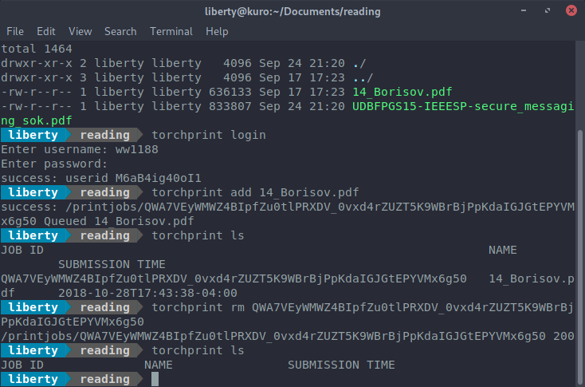

torchprint
---
CLI and library to manage your printer job queue at NYU (for GNU/Linux, Windows, MacOS)

> Disclaimer: this project is not affiliated or endorsed by NYU.

# CLI



## Why
Because NYU IT doesn't provide driver installer for GNU/Linux. And with this you can also send docs to printer job queue directly from terminal.

## Usage
- Login
  - `torchprint login` then follow prompt
- Add a document (pdf, doc, txt, etc) to printer job queue
  - `torchprint add [file-to-print]`
  - `--side single` or `--side double`. Default is double
  - `--color` for color, otherwise monochrome.
- View printer job queue
  - `torchprint ls`
- Delete a job from queue
  - `torchprint rm [job-id]`
  - Delete everything with `--all`
- ~~Edit a job in queue~~ (coming soon)

> Don't worry, you can always use `torchprint help`. (And no it won't call the help desk for you)

## Building
```
$ go get -u github.com/libertylocked/torchprint/cmd/torchprint
$ $GOPATH/bin/torchprint version
```

# Library
## Example
```go
import (
	"fmt"

	"github.com/libertylocked/torchprint"
)

func main() {
	// To get your user ID and token
	logon, token, _ := torchprint.NewAPI("").SetUserPass("username", "password")
	userID := logon.Identifier // User ID

	// To make requests using User ID and Session Token
	api := torchprint.NewAPI(userID).SetToken(token)
	// You can also make requests using User ID and Username:Password (instead of token)
	// api := torchprint.NewAPI(userID).SetUserPass("username", "password")

	// View all printjobs in queue
	api.GetPrintJobs()
	// Upload a document and create a printjob
	api.AddPrintJob("/home/liberty/Documents/pirated_textbook.pdf", torchprint.FinishingOptions{
		Mono:            true,
		Duplex:          true,
		PagesPerSide:    1,
		Copies:          1,
		DefaultPageSize: "Letter",
	})
}
```

## API Documentation
None ;)
